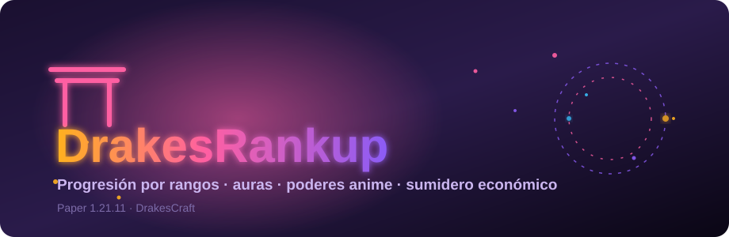

<div align="center">



# ⛩️ DrakesRankup

**Sistema de progresión por rangos anime/shōnen, auras, poderes y sumidero económico de late-game para DrakesCraft.**

`Paper 1.21.11` · `Java 21` · `LuckPerms` · `Essentials` (opcional)

</div>

---

## Qué hace

DrakesRankup es la escalera de progresión de largo plazo de DrakesCraft: 50 tiers
de rango que el jugador sube pagando desde su economía, cada uno con **aura
visual, habilidades y transformaciones** de temática anime. Está pensado como
**sumidero económico**: da a los jugadores ricos algo en qué gastar sin romper el
balance del servidor.

Sólo opera en las modalidades personalizadas (**Slimefun, OneBlock, SkyBlock**);
el **Clásico** queda excluido a propósito.

---

## Características

### Progresión
- **50 tiers** de rango con coste creciente y sincronización real con LuckPerms.
- **Auto-reparación de rango al entrar**: si LuckPerms y el tier se desalinean
  (incluso offline), se reconcilian solos.
- **Bolsa de ascenso** sin tope para acumular pagos de los rangos que superan el
  tope de dinero en mano.

### Auras y efectos visuales
- **Cobertura continua tier 1–50**, en cinco franjas temáticas (iniciados →
  legendarios). La densidad de partículas escala con el tier dentro de cada franja.
- **Auras de transformación** para los poderes anime activos (MUI, Ultra Ego,
  Gohan Beast, Broly, SSJ Blue/God…).
- **Tres niveles de intensidad**: completo → reducido → apagado. El reducido
  aligera a la mitad la densidad y el tráfico, para quien el efecto le molesta pero
  no quiere perderlo.

### Habilidades
- **Empuje cinético** (Shunpo): impulso direccional con doble salto y cooldown.
- **Vuelo de Ki** (tier 31+): dash sónico con inmunidad a caída.
- **Convivencia con el vuelo de rango**: si el jugador tiene fly legítimo
  (Essentials, permiso o staff), las habilidades de impulso **no** secuestran su
  vuelo. El doble salto vuela; no se convierte en dash.

### Staff
- **Modo Ángel** (`/angel`): invulnerabilidad y aura de halo doble para
  administración.

---

## Comandos

| Comando | Alias | Descripción |
|---|---|---|
| `/rankup` | `ranks`, `rangos`, `subirrango` | Abre la GUI, asciende de rango o gestiona pruebas. |
| `/rankup particles` | — | Cicla la intensidad del aura: completo → reducido → apagado. |
| `/rankup set <jugador> <tier>` | — | Fija el tier de un jugador *(admin)*. |
| `/transform` | `transformaciones`, `ki`, `poderes` | GUI de transformaciones y poderes anime. |
| `/angel` | `zenosama`, `zeno`, `daishinkan` | Modo staff de deidad *(permiso `drakesrankup.staff`)*. |

---

## Permisos

| Permiso | Para qué |
|---|---|
| `drakesrankup.staff` | Comandos de staff (`/angel`, gestión). |
| `drakesrankup.admin` | Bypass total; incluye bypass de vuelo. |
| `essentials.fly` | Tratado como vuelo legítimo: las habilidades no lo secuestran. |

---

## Ajustes por jugador

Cada jugador conserva sus preferencias (persistidas en el `players.yml` del plugin):

- **Partículas**: completo / reducido / apagado (`/rankup particles`).
- **Empuje cinético**: activar/desactivar desde la GUI de rangup.
- **Vuelo de Ki**: activar/desactivar desde la GUI de transformaciones.
- **Transformación activa**: la que aplica el aura permanente.

> Los toggles de empuje y vuelo de Ki viven en menús distintos. Da igual cuál
> desactives: si tienes vuelo de rango, **ninguno** interfiere con volar.

---

## Compatibilidad

- **LuckPerms** — obligatorio, para la sincronización de grupos de rango.
- **Essentials** — opcional; si está, su modo de vuelo se respeta como vuelo legítimo.
- **Mundos** — sólo actúa en las modalidades configuradas (`settings` del `config.yml`).

---

## Build

```bash
mvn clean package
```

El artefacto sale en `target/DrakesRankup-v1.0.0.jar`. Autor: **JackStar6677-1**.
